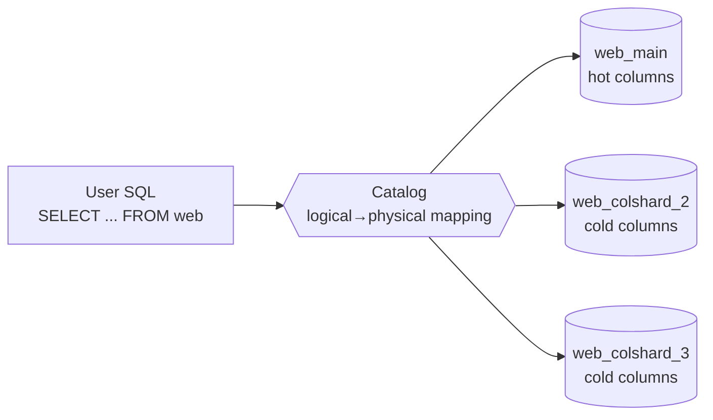
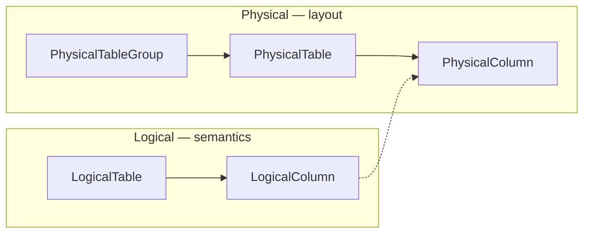
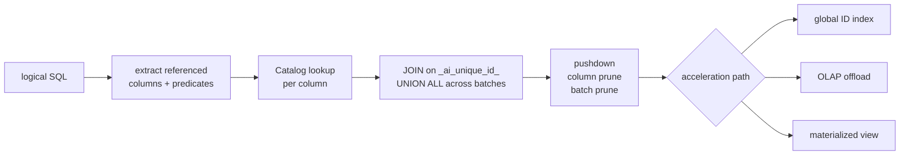
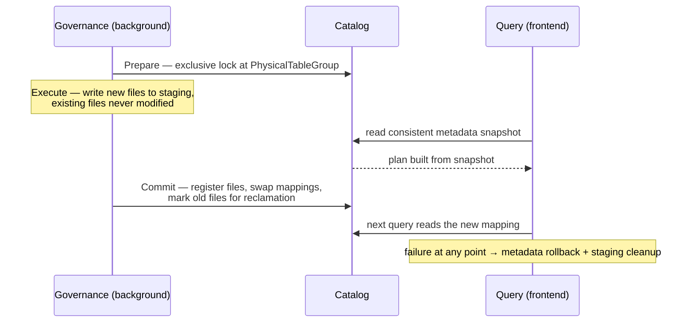

# OmniTable

### Logical Unification, Physical Separation

A unified wide table for petabyte-scale LLM data curation — and what it says about separating *logical structure* from *physical layout* in a data lake.

<div class="pt-10">
  <span class="px-2 py-1 rounded bg-white bg-opacity-10 text-sm">
    arXiv 2609.11148 · PVLDB 2026 · <strong>Best Industry Paper</strong> · Ant Group
  </span>
</div>

<!--
Focus of this deck: the data-lake design, not the LLM-lifecycle plumbing.
The claim worth examining is that a wide table can be a virtual view.
-->

---
layout: default
---

# What this deck covers

<v-clicks>

- **Why** — where lakehouse formats stop, and what LLM curation needs instead
- **The abstraction** — one logical table, a Table Family underneath, one mapping boundary
- **In practice** — how a query against a nonexistent table actually resolves
- **Consistency** — how layout gets rewritten underneath live traffic
- **Evidence, then assessment** — the production numbers, and what to discount

</v-clicks>

<!--
Every factual claim here comes from the paper. Reconstructions are flagged on-slide.
-->

---
layout: section
---

# Why

Where lakehouse stops, and what the pipeline maze costs

---

# The paper

| | |
|---|---|
| **Authors** | 19 authors, all at Ant Group; corresponding author Jun Zhou |
| **Venue** | PVLDB Vol. 19, No. 12, pp. 4276–4289, 2026 |
| **Award** | **VLDB 2026 Best Industry Paper** (per the arXiv comment field) |
| **IDs** | doi 10.14778/3827998.3828032 · arXiv 2609.11148 (2026-09-10), CC BY-NC-ND 4.0 |
| **Genre** | Self-described **"architecture blueprint"** — design + production measurements, not a new algorithm |
| **Production** | **35 PB**, 305B+ records, 16 physical tables, 392+ batches |
| **Headline** | Curation cycle **14 days → 2.5 days (5.6×)**, manual steps **−73%** |

<!--
The 5.6x figure is the one most likely to be misquoted. It is workflow-level,
not system-level — we come back to that in the assessment section.
-->

---

# Where lakehouse formats stop

Delta Lake / Iceberg / Paimon already give you ACID, time travel and schema evolution on object storage.

<v-clicks>

- They remain **table-centric**: the table is simultaneously the *logical* unit and the *physical* unit
- Two things they don't treat as first-class lifecycle objects:
  - a **column / UDF dependency DAG**
  - **operator-aware CPU/GPU routing**
- In LLM curation the unit of iteration is a **feature**, not a table — columns are computed by UDF DAGs, not appended as rows

</v-clicks>

<br>

> OmniTable positions itself as a reusable layer *above* storage, not a replacement for it.

---

# The pipeline maze

<div class="grid grid-cols-3 gap-4 pt-4">

<div class="p-4 rounded border border-gray-400 border-opacity-30">

**Data silos**

Dozens of sources scattered over **hundreds of physical tables**. Cross-dataset discovery is the hard part.

</div>

<div class="p-4 rounded border border-gray-400 border-opacity-30">

**Costly features**

For a *single* feature, an engineer had to **"drag and drop 106 tables onto the task canvas."**

</div>

<div class="p-4 rounded border border-gray-400 border-opacity-30">

**Broken lineage**

UDF logic spread across codebases, no centralized version control. Definitions drift; iterations can't be traced.

</div>

</div>

<div class="pt-8 text-lg opacity-80">

The iteration unit is a *table*, so cost scales with the number of datasets — the exact opposite of what ablation-driven research needs.

</div>

---
layout: statement
---

# One table.

# Many physical layouts.

# One boundary between them.

---
layout: section
---

# The abstraction

One logical table · a Table Family underneath · one mapping boundary

---

# The wide table is a virtual view



<v-clicks>

- The logical table has **no physical existence** — it is resolved **per query**
- Nobody *writes* to it: ingestion adds **rows**, feature backfill adds **columns** — both land in physical tables
- The `Catalog` is the single consistency decision point

</v-clicks>

<!--
This diagram is the whole talk. Everything after it is mechanism.
-->

---

# The logical schema

```sql
CREATE TABLE OmniTable (
  _ai_unique_id_   STRING NOT NULL,  -- global primary key & lineage anchor
  _ai_append_name_ STRING NOT NULL,  -- ingestion batch / source tag

  RawData          STRUCT<...>,      -- stage-aware core column groups
  ProcessedData    STRUCT<...>,
  TrainableData    STRUCT<...>,

  Feature_1 <Type1>, ... Feature_N <TypeN>   -- unbounded feature columns
);
```

<div class="pt-4 opacity-80">

Illustrative (paper's Listing 1). This is a **logical contract** — there is no physical `CREATE TABLE` behind it.

</div>

---

# Four principles of the logical model

<v-clicks>

- **Global primary key alignment** — one key aligns rows across sources, stages and features, enabling backfill joins, point lookups and lineage auditing
- **Stage-aware data evolution** — `RawData` / `ProcessedData` / `TrainableData`, with version suffixes (`ProcessedData_v2`) so processing iterations become versioned columns
- **Unbounded feature column expansion** — quality scores, domain labels, compliance flags, dedup signatures: registered, versioned, auto-refreshed
- **Batch-level governance** — the batch is the basic unit for auditing, task splitting and query pruning

</v-clicks>

---

# Three columns that carry the design

<div class="grid grid-cols-3 gap-4 pt-2">

<div class="p-4 rounded border border-gray-400 border-opacity-30">

**`_ai_unique_id_`**

Global PK. Default is **MD5 of `raw_data`** — a deterministic content hash, so dedup is free and needs no coordination. Random UUID when content dedup is unwanted (SFT).

</div>

<div class="p-4 rounded border border-gray-400 border-opacity-30">

**`_ai_append_name_`**

Batch + source + version. One tag doing three jobs: **backfill scheduling granularity**, **query pruning key**, **audit trail**.

</div>

<div class="p-4 rounded border border-gray-400 border-opacity-30">

**The stage groups**

`RawData` → `ProcessedData` → `TrainableData`: original payload, cleaned intermediate form, trainable form.

</div>

</div>

<div class="pt-6 opacity-80">

Because the key is a content hash, identical content from different sources *collapses into one row*. That is intentional — but it is a semantic choice about provenance, not a storage detail.

</div>

---

# The Table Family — five layers, one boundary



<v-clicks>

- `LogicalTable` is the user-facing wide table (`aidata://tables/web`)
- `PhysicalTableGroup` groups physical tables by function or batch — **this is the lock granularity**
- The boundary is exactly **one layer of indirection**: `LogicalColumn ↔ PhysicalColumn`

</v-clicks>

---

# Where the five layers live

<v-clicks>

- `LogicalColumn` carries name, type, **analysisType** and comment — pure semantics
- `PhysicalTable` lives on MaxCompute or OSS: storage path, partition info, file format
- `PhysicalColumn` is linked to its `LogicalColumn` by **bidirectional reference** in the Catalog
- Everything above the boundary is semantics; everything below is layout

</v-clicks>

---

# What a mapping entry carries

```ts
LogicalColumn: quality_score   // type: double, analysisType: score

  physicalLocation -> PhysicalTable: web_main   // engine, path, partitions, format
  version          -> feature version, not schema version
  updatedAt        -> timestamp
  // ...and the reverse reference, so a PhysicalColumn knows which
  //    LogicalColumn it serves.
```

<v-clicks>

- **Version + timestamp on every entry** → historical backtracking is free
- Metadata lives in a **relational DB with optimistic locking** for concurrent updates
- Production metadata query latency stays at the **millisecond level** — the indirection is cheap on the read path

</v-clicks>

<!--
Structure is illustrative; the load-bearing facts are: bidirectional reference,
version+timestamp per entry, relational store with optimistic locking, ms latency.
-->

---

# The batch dimension

Every ingestion atomically registers an **Append entry**:

```ts
Append {
  _ai_append_name_: "cc",           // batch name
  physicalTables:   [ web_main, web_colshard_2, ... ],
  rowCount:         ...,
  ingestedAt:       ...,
  source:           ...
}
```

<v-clicks>

- `WHERE _ai_append_name_ = 'cc'` lets the optimizer **locate the exact physical table subset** and skip everything else — I/O reduction with no data movement
- The *same* identifier is the scheduling unit for incremental backfill and the unit for audit backtracking

</v-clicks>

---
layout: section
---

# The virtual view in practice

Resolving a query against a table that doesn't exist

---

# Resolving a query



<div class="pt-2 opacity-80 text-sm">

Translation is **not a table-name substitution** — logical columns may live in different physical tables, so it is multi-step reasoning.

</div>

---

# The rewrite, concretely

````md
```sql {1-4|6-13|all}
-- what you write: one logical table
SELECT _ai_unique_id_, quality_score, math_recall
FROM   aidata://tables/web
WHERE  _ai_append_name_ IN ('cc','cc2') AND quality_score > 0.7;

-- what the optimizer builds: JOIN on the global key, UNION ALL across batches
SELECT a._ai_unique_id_, a.quality_score, b.math_recall
FROM  ( SELECT * FROM main_cc  WHERE quality_score > 0.7
        UNION ALL
        SELECT * FROM main_cc2 WHERE quality_score > 0.7 ) a
JOIN  ( SELECT _ai_unique_id_, math_recall FROM colshard_2 ) b
  ON    a._ai_unique_id_ = b._ai_unique_id_;
```
````

<div class="pt-2 opacity-80 text-sm">

Illustrative reconstruction — the paper describes this rewrite but does not print the SQL. **Column pruning** is what stops the large `raw_data` column from ever being read.

</div>

---

# Column splitting: crossing the engine's width wall

<v-clicks>

- The web wide table has **800+ logical columns** — but MaxCompute imposes a **~1200-column** physical limit
- The governance service groups columns by **access frequency from query logs**
- Low-frequency feature columns migrate to auxiliary tables (**Column Shards**) holding only `_ai_unique_id_` plus the migrated columns
- The main table keeps high-frequency and core columns

</v-clicks>

<br>

> In production: **800+ logical columns across 4–6 physical tables of 200–300 columns each.** Queries touching only high-frequency columns need *no JOIN at all*.

---

# What column splitting actually changes

```text
BEFORE   one physical table is close to the ~1200-column engine limit

  [all 800+ LogicalColumns]  -->  PhysicalTable: web_main


AFTER    only mapping pointers change; the logical DDL is untouched

  quality_score     (hot)  -->  PhysicalTable: web_main
  lang_detect       (hot)  -->  PhysicalTable: web_main
  math_recall_v4    (cold) -->  PhysicalTable: web_colshard_2   [id + col]
  boilerplate_flag  (cold) -->  PhysicalTable: web_colshard_3   [id + col]
```

<div class="pt-3 opacity-80 text-sm">

Physical table names illustrative. The load-bearing claim: **no logical schema change, no consumer change** — the optimizer simply reads the latest mapping. Row splitting and small-partition merges work the same way.

</div>

---
layout: statement
---

# Logical view stability

# is decoupled from

# physical layout evolvability

---
layout: section
---

# Keeping it consistent

Rewriting layout underneath live traffic

---

# A virtual view needs a commit protocol

<v-clicks>

- Continuous writes at PB/day plus growing column counts inevitably degrade: small files, column limits, partition skew
- So the system continuously **rewrites physical layout in the background** — while queries and ingestion keep running
- That means a reader can be mid-query when its physical tables are being split or merged
- The answer is not locking readers. It is **making layout changes invisible until an atomic commit**

</v-clicks>

---

# Prepare – Execute – Commit



---

# Reads don't lock — they snapshot

<v-clicks>

- Frontend reads **do not take exclusive locks**
- Instead they take a **consistent metadata snapshot at query start**
- In-flight queries are therefore unaffected by concurrent background reorganization
- The lock is only needed where writes collide — at `PhysicalTableGroup` granularity, coarse enough to be rare and fine enough to be parallel

</v-clicks>

<br>

> Snapshot isolation on *metadata*, staged writes on *data*, atomic pointer swap to publish.

---
layout: section
---

# Evidence

And what to discount

---

# What it runs on

| Table | Records | Size | Logical cols | Physical tables | Batches |
|---|---|---|---|---|---|
| **web** | 300B+ | 25 PB | 800+ | **6** | 200+ |
| code | 3.4B | 3.8 PB | 350 | 4 | 85 |
| pdf | 1.8B | 5.2 PB | 280 | 3 | 62 |
| post_sft | 210M | 0.8 PB | 120 | 3 | 45 |
| **Total** | **305B+** | **35 PB** | — | **16** | **392+** |

<div class="pt-4 opacity-80 text-sm">

Parquet on OSS plus a MaxCompute warehouse; Catalog on MySQL, index on HBase, OLAP on ClickHouse. A real production deployment, not a testbed.

</div>

---

# The two curves that validate the separation

<div class="grid grid-cols-2 gap-6 pt-2">

<div class="p-4 rounded border border-gray-400 border-opacity-30">

**Data volume: 1 TB → 25 PB**

- **OmniTable:** stable **18–23 TB/h**
- No governance: ~10 TB/h at 5 PB, ~5 TB/h at 25 PB
- Legacy: ~2 TB/h at 25 PB (**9.5× slower**)

</div>

<div class="p-4 rounded border border-gray-400 border-opacity-30">

**Schema width: 200 → 2500 columns**

- **OmniTable:** P95 **25 s → 38 s (1.53×)**
- No governance: 110 s at 1500 columns (~3×)
- Beyond 1200 columns the ablation's queries **fail outright**

</div>

</div>

<div class="pt-6 opacity-80">

The width result is the key one for a data lake: **it crosses a hard engine limit with no performance discontinuity** — because crossing it is a mapping update, not a table redesign.

</div>

---

# What to take

<v-clicks>

- **One layer of indirection is the entire design.** A single `LogicalColumn ↔ PhysicalColumn` boundary, owned by one service, buys both schema evolution and layout freedom
- **Treat engine limits as architecture constraints, not user problems.** 1200 columns is a physical fact; it should never reach the person writing SQL
- **Make the batch a first-class dimension.** One identifier serving scheduling, pruning and audit is unusually good design economy
- **Give the virtual view a commit protocol.** Stage writes, snapshot reads, atomic publish
- **Adoption beats capability.** The logical table speaks plain SQL and lineage records are queryable tables — value first, new workflow second

</v-clicks>

---

# What to discount

<v-clicks>

- **5.6× is workflow-level, not system-level.** The baseline is historical task logs measuring coordination cost (locate tables, wire pipelines, diagnose, resubmit). Explicitly orthogonal to compute-level optimization — **not** a throughput comparison against another engine
- **No public benchmark, no head-to-head system comparison.** The authors' reason (settings too different for a shared benchmark) is fair, but the numbers are not independently reproducible
- **"Second-level point lookups" are 5–15 s** (P50 8.3 s) — an index-assisted partial scan plus multi-table column assembly, not a point read
- **Key hyperparameters are missing** — materialization thresholds and the column-split access-frequency cutoff are only ever "exceeds a threshold"

</v-clicks>

---

# Takeaways for our own lake

<v-clicks>

- If logical and physical are the same object today, **a single mapping layer is the cheapest first step** — schema evolution without touching consumers
- **Budget the indirection:** ~8–15% extra storage for hot column groups, and 5–8% of cluster resources for continuous compaction
- **Decide the global key up front.** MD5-of-content buys free dedup but collapses provenance — a semantic decision, not a storage one
- **Reorganization needs staging + atomic commit + reclamation**, and a lock granularity coarse enough to be rare, fine enough to be parallel

</v-clicks>

---
layout: center
---

# Questions

<div class="pt-6 opacity-70 text-sm">

Full written analysis (Chinese + English) lives in `my-wiki/05-References/`.

</div>

---
layout: end
---

# Thank you

<style>
.slidev-layout table { font-size: 0.82em; }
.slidev-layout code { font-size: 0.9em; }
</style>
